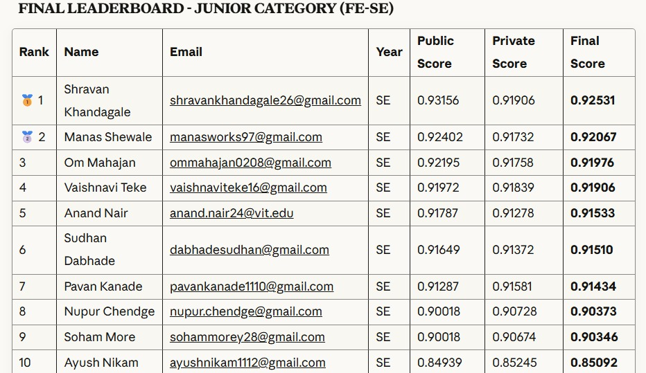

# DataQuest '25 - Pulzion Competition 🏆

## Achievement 
**Secured 3rd Place** 🎉 in DataQuest 2025, organized by Pulzion '25!

---

## Competition Overview

**DataQuest 2025** was an inter-college machine learning competition organized by ACM Pict as part of Pulzion '25 event.

### Challenge Details
- **Evaluation Metric**: F1 Score (Macro)
- **Submission Limit**: 5 submissions in total

---

## Problem Statement

The competition involved predicting Air Quality Index (ASI) categories based on meteorological and environmental features. The target variable `ASI_category` had three classes: **Good**, **Moderate**, and **Poor**.

---

## Notebooks Overview

### Initial Exploration & Hyperparameter Tuning

#### [main.ipynb](main.ipynb)
- Data loading and exploration
- XGBoost baseline implementation
- Optuna hyperparameter optimization (30 trials)
- Best F1 Score: **0.9260**

#### [nb1.ipynb](nb1.ipynb)
- Extended Optuna hyperparameter tuning for:
  - XGBoost
  - LightGBM
  - Random Forest
- Stratified train-validation splits

### Feature Engineering Experiments

#### [nb2.1.ipynb](nb2.1.ipynb)
- Feature engineering with meteorological interactions
- Feature importance analysis using XGBoost
- StandardScaler normalization
- Feature selection techniques

#### [nb2.2.ipynb](nb2.2.ipynb)
- Advanced meteorological feature engineering including:
  - Temperature differentials and ratios
  - Rainfall intensity calculations
  - Wind gust ratios
  - Pressure differences
  - Humidity-based features
  - Comprehensive interaction features

#### [nb3.ipynb](nb3.ipynb)
- Data preprocessing and label encoding
- Train-validation split (95-5)
- Optuna hyperparameter optimization for XGBoost

### Competition Submission

#### [final.ipynb](final.ipynb)
- Stratified K-Fold cross-validation
- Multi-model ensemble:
  - XGBoost with optimized parameters
  - LightGBM with early stopping
  - CatBoost for categorical handling
- Sample weighting for class balance
- Isotonic regression calibration
- Final submission CSV generation

---

### Post-Competition Improvements

*Further experimentation after the competition achieved even better results, surpassing the competition performance.*

#### [AfterPulzion.ipynb](AfterPulzion.ipynb)
- XGBoost, LightGBM, and Random Forest base models
- Manual weighted soft voting ensemble
- Grid search for optimal ensemble weights
- Early stopping for gradient boosting models
- **Results**: F1 Score **0.9424**, Accuracy **0.9576**

#### [AfterPulzion2.ipynb](AfterPulzion2.ipynb)
- Memory optimization for efficient data handling
- XGBoost, LightGBM, and Random Forest training
- Optimized hyperparameters for each model
- Early stopping callbacks
- **Results**: F1 Score **0.9401**, Accuracy **0.9562**

#### [AfterPulzion_Exploratory.ipynb](AfterPulzion_Exploratory.ipynb)
- Comprehensive ensemble method comparison
- Weighted blending with grid search optimization
- Base model training (XGBoost, LightGBM, Random Forest)
- F1 score tracking across different techniques
- Scipy-based optimization experiments

---

## Key Techniques Applied

### Feature Engineering
- Meteorological feature interactions (temperature, humidity, wind)
- Thermal comfort indicators (heat index, wind chill)
- Atmospheric stability metrics
- Cyclic encoding for directional features
- Polynomial feature transformations

### Model Optimization
- Bayesian hyperparameter optimization (Optuna)
- Stratified K-Fold cross-validation
- Early stopping to prevent overfitting
- L1/L2 regularization

### Ensemble Methods
- Soft voting classifiers
- Weighted blending
- Multi-level stacking
- Bayesian model averaging
- Knowledge distillation
- Calibrated probability predictions

### Advanced Techniques
- Isotonic regression calibration
- Sample weighting for class imbalance
- Memory-optimized data processing

---

## License

This project is licensed under the MIT License - see the [LICENSE](LICENSE) file for details.